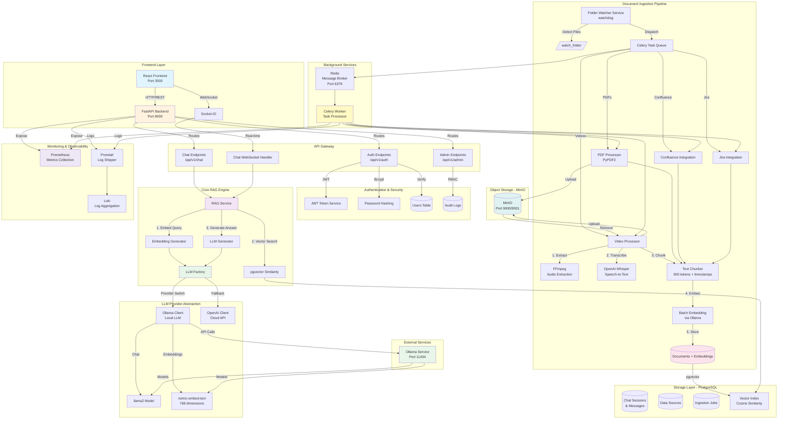
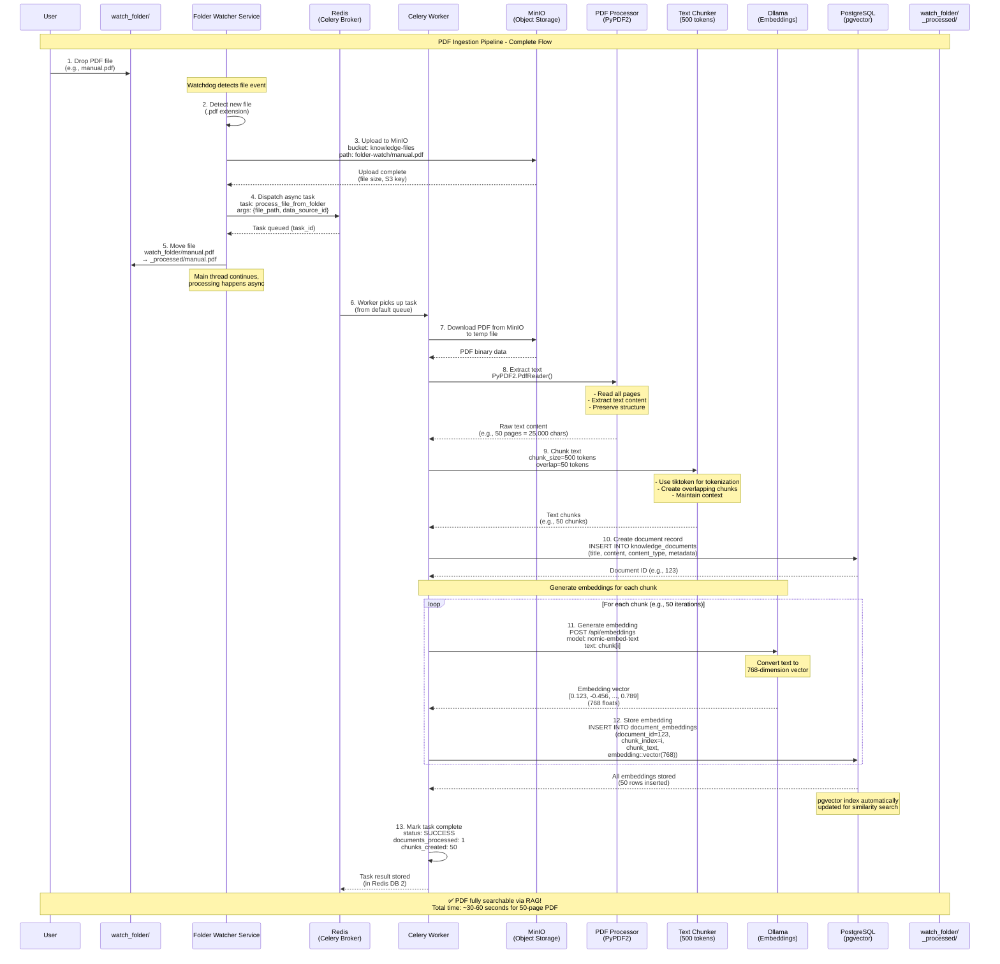
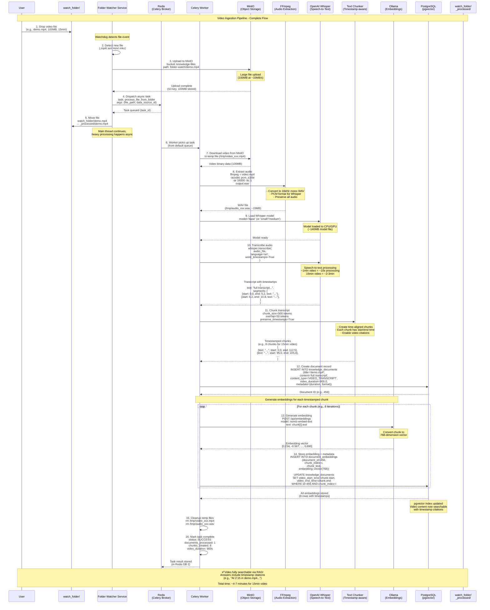

# GenAI Intelligent Chat-Based Knowledge Retrieval System

A GenAI-powered chat-based knowledge retrieval application that enables users to query and obtain accurate, context-aware responses from multiple structured and unstructured data sources.

## Features

- **Chat Interface**: Conversational interface for querying knowledge sources
- **Multi-Source Integration**: Confluence, Jira, and onboarding materials
- **GenAI Powered**: Context-aware responses using LLMs
- **Role-Based Access**: Regular users and admin users with different permissions
- **Real-time Updates**: Scheduled data refresh from knowledge sources

## Tech Stack

### Backend
- **Framework**: FastAPI
- **Language**: Python 3.11+
- **Database**: PostgreSQL with pgvector
- **Cache**: Redis
- **ORM**: SQLAlchemy with Alembic migrations
- **GenAI**: OpenAI API or Ollama (local LLM), LangChain
- **Vector Store**: ChromaDB / FAISS
- **Task Queue**: Celery

### Frontend
- **Framework**: React 18
- **Build Tool**: Vite
- **Styling**: Tailwind CSS
- **State Management**: Zustand
- **Data Fetching**: React Query
- **Routing**: React Router

## Getting Started

### Prerequisites

- Python 3.11+
- Node.js 18+
- PostgreSQL 15+
- Redis 7+
- Docker & Docker Compose (optional)

### Environment Configuration

Before running the application, you need to configure environment variables:

1. **Copy the environment template:**
   ```bash
   cp .env.example .env
   ```

2. **Edit the `.env` file with your credentials:**
   ```bash
   nano .env  # or use your preferred editor
   ```

3. **Required configurations (minimum to start):**
   - `SECRET_KEY`: Generate using `openssl rand -hex 32`
   - `LLM_PROVIDER`: Choose `ollama` (free, local) or `openai` (cloud, requires API key)
   - `POSTGRES_PASSWORD`: Change from default for production
   - `REDIS_PASSWORD`: Change from default for production
   - `MINIO_ROOT_PASSWORD`: Change from default for production

   **For Ollama (Recommended - No API Key Required):**
   - Set `LLM_PROVIDER=ollama` in `.env`
   - See [OLLAMA_SETUP.md](OLLAMA_SETUP.md) for detailed setup instructions
   - Run `./scripts/setup-ollama.sh` to download required models

   **For OpenAI:**
   - Set `LLM_PROVIDER=openai` in `.env`
   - `OPENAI_API_KEY`: Get from [OpenAI Platform](https://platform.openai.com/api-keys)

4. **Optional configurations (for full functionality):**
   - **Confluence Integration:**
     - `CONFLUENCE_URL`: Your Confluence instance URL
     - `CONFLUENCE_USERNAME`: Your Confluence email
     - `CONFLUENCE_API_TOKEN`: Generate at [Atlassian API Tokens](https://id.atlassian.com/manage/api-tokens)
     - `CONFLUENCE_SPACE_KEY`: Space key to index (e.g., "DOCS")

   - **Jira Integration:**
     - `JIRA_URL`: Your Jira instance URL
     - `JIRA_USERNAME`: Your Jira email
     - `JIRA_API_TOKEN`: Generate at [Atlassian API Tokens](https://id.atlassian.com/manage/api-tokens)
     - `JIRA_PROJECT_KEY`: Project key to index (e.g., "PROJ")

5. **Security best practices:**
   - **Never commit `.env` file to version control** (already in `.gitignore`)
   - Use strong, unique passwords for all services
   - Rotate credentials regularly in production
   - Use different credentials for development, staging, and production
   - Store production secrets in a secure secret manager (e.g., AWS Secrets Manager, HashiCorp Vault)

6. **Verify your configuration:**
   ```bash
   # Check if .env file exists and is readable
   cat .env | grep -v "^#" | grep -v "^$" | head -5

   # Validate required variables are set (example)
   grep "SECRET_KEY" .env
   grep "OPENAI_API_KEY" .env
   ```

### Installation

See [setup-log.md](artifacts/setup/setup-log.md) for detailed setup instructions.

## Project Structure

```
project-code/
├── backend/           # FastAPI backend application
├── frontend/          # React frontend application
├── infrastructure/    # Infrastructure as Code and deployment configs
├── config/            # Configuration files
├── docs/              # Documentation
└── scripts/           # Utility scripts
```

## License

Proprietary

***
### System Architecture

***
### Component Details & Purposes

```mermaid
graph LR
    subgraph "1. User Interface Layer"
        A1[React Frontend] --> A1P["Purpose: User interaction<br/>- Chat interface<br/>- Admin dashboard<br/>- Real-time updates via WebSocket"]
    end
    
    subgraph "2. API & Gateway"
        B1[FastAPI Backend] --> B1P["Purpose: API Gateway<br/>- Route HTTP requests<br/>- WebSocket management<br/>- Middleware & CORS<br/>- Request validation"]
    end
    
    subgraph "3. Authentication System"
        C1[JWT Service] --> C1P["Purpose: Stateless Auth<br/>- Generate access tokens<br/>- Token validation<br/>- Secure sessions"]
        C2[Bcrypt Hashing] --> C2P["Purpose: Password Security<br/>- Hash user passwords<br/>- Prevent plaintext storage<br/>- Rainbow table protection"]
        C3[RBAC] --> C3P["Purpose: Access Control<br/>- Admin vs User roles<br/>- Permission enforcement<br/>- Audit trail"]
    end
    
    subgraph "4. RAG Core Engine"
        D1[RAG Service] --> D1P["Purpose: Intelligent QA<br/>- Query understanding<br/>- Context retrieval<br/>- Answer generation<br/>- Citation management"]
        D2[Embedding Generator] --> D2P["Purpose: Query Vectorization<br/>- Convert text to 768d vectors<br/>- Enable semantic search<br/>- Match user intent"]
        D3[pgvector Search] --> D3P["Purpose: Similarity Ranking<br/>- Cosine similarity @ 0.6<br/>- Find relevant chunks<br/>- Return top-k results"]
        D4[LLM Generator] --> D4P["Purpose: Natural Answers<br/>- Generate human-like text<br/>- Stay grounded in context<br/>- Cite sources"]
    end
    
    subgraph "5. LLM Abstraction"
        E1[LLM Factory] --> E1P["Purpose: Provider Flexibility<br/>- Switch between Ollama/OpenAI<br/>- Abstract API differences<br/>- Enable local-first deployment"]
        E2[Ollama Client] --> E2P["Purpose: Local LLM Inference<br/>- No cloud dependency<br/>- Data privacy<br/>- Cost savings<br/>- llama2 + nomic-embed-text"]
        E3[OpenAI Client] --> E3P["Purpose: Cloud Fallback<br/>- Higher quality models<br/>- GPT-4 support<br/>- Production reliability"]
    end
    
    subgraph "6. Document Ingestion"
        F1[Folder Watcher] --> F1P["Purpose: Auto-Ingestion<br/>- Monitor watch_folder/<br/>- Detect new files<br/>- Trigger processing<br/>- Move to _processed/"]
        F2[PDF Processor] --> F2P["Purpose: Extract PDF Text<br/>- PyPDF2 parsing<br/>- Preserve structure<br/>- Handle multi-page docs"]
        F3[Video Processor] --> F3P["Purpose: Video-to-Text<br/>- FFmpeg audio extraction<br/>- Whisper transcription<br/>- Timestamp preservation<br/>- Video citations"]
        F4[Confluence] --> F4P["Purpose: Wiki Integration<br/>- Fetch spaces/pages<br/>- Sync knowledge base<br/>- Auto-update on changes"]
        F5[Jira] --> F5P["Purpose: Ticket Integration<br/>- Index issues/comments<br/>- Capture project context<br/>- Answer from tickets"]
    end
    
    subgraph "7. Processing Pipeline"
        G1[FFmpeg] --> G1P["Purpose: Audio Extraction<br/>- Convert video to 16kHz WAV<br/>- Prepare for Whisper<br/>- Handle all video formats"]
        G2[Whisper] --> G2P["Purpose: Speech-to-Text<br/>- Industry-standard accuracy<br/>- Multi-language support<br/>- Timestamped segments"]
        G3[Text Chunker] --> G3P["Purpose: Smart Chunking<br/>- 500 token chunks<br/>- 50 token overlap<br/>- Preserve context<br/>- Timestamp metadata"]
        G4[Batch Embedder] --> G4P["Purpose: Vectorization<br/>- Generate 768d vectors<br/>- Batch processing<br/>- Store in pgvector"]
    end
    
    subgraph "8. Storage - PostgreSQL"
        H1[knowledge_documents] --> H1P["Purpose: Document Storage<br/>- Full text content<br/>- Metadata fields<br/>- Video timestamps<br/>- Source tracking"]
        H2[document_embeddings] --> H2P["Purpose: Vector Storage<br/>- 768d vectors<br/>- Chunk text<br/>- Token counts<br/>- Similarity search index"]
        H3[users] --> H3P["Purpose: User Management<br/>- Credentials<br/>- Roles<br/>- Profile data"]
        H4[chat_sessions] --> H4P["Purpose: Conversation History<br/>- Track chat threads<br/>- Message storage<br/>- Context preservation"]
        H5[data_sources] --> H5P["Purpose: Source Registry<br/>- Track ingestion sources<br/>- Configuration<br/>- Status monitoring"]
        H6[ingestion_jobs] --> H6P["Purpose: Job Tracking<br/>- Processing status<br/>- Error logs<br/>- Retry logic"]
    end
    
    subgraph "9. Object Storage - MinIO"
        I1[MinIO] --> I1P["Purpose: File Storage<br/>- Store original files<br/>- S3-compatible API<br/>- Backup & retrieval<br/>- Scale storage separately"]
    end
    
    subgraph "10. Task Queue - Celery + Redis"
        J1[Redis] --> J1P["Purpose: Message Broker<br/>- Queue async tasks<br/>- Fast in-memory cache<br/>- Reliable message delivery"]
        J2[Celery Worker] --> J2P["Purpose: Background Processing<br/>- Offload heavy tasks<br/>- Parallel processing<br/>- Keep API responsive<br/>- Handle failures gracefully"]
    end
    
    subgraph "11. Monitoring & Observability"
        K1[Prometheus] --> K1P["Purpose: Metrics Collection<br/>- Track performance<br/>- Monitor resource usage<br/>- Alert on anomalies"]
        K2[Loki] --> K2P["Purpose: Log Aggregation<br/>- Centralized logs<br/>- Query across services<br/>- Debug production issues"]
        K3[Promtail] --> K3P["Purpose: Log Shipping<br/>- Collect container logs<br/>- Label & filter<br/>- Send to Loki"]
    end
    
    subgraph "12. External Services"
        L1[Ollama Service] --> L1P["Purpose: Model Serving<br/>- Host LLM models locally<br/>- REST API endpoint<br/>- Model management<br/>- GPU acceleration support"]
    end

    style A1P fill:#e1f5ff
    style B1P fill:#fff3e0
    style C1P fill:#fce4ec
    style C2P fill:#fce4ec
    style C3P fill:#fce4ec
    style D1P fill:#f3e5f5
    style D2P fill:#f3e5f5
    style D3P fill:#f3e5f5
    style D4P fill:#f3e5f5
    style E1P fill:#e8f5e9
    style E2P fill:#e8f5e9
    style E3P fill:#e8f5e9
    style F1P fill:#fff9c4
    style F2P fill:#fff9c4
    style F3P fill:#fff9c4
    style F4P fill:#fff9c4
    style F5P fill:#fff9c4
    style H1P fill:#ffebee
    style H2P fill:#ffebee
    style I1P fill:#e0f2f1
    style J1P fill:#fce4ec
    style J2P fill:#fce4ec
    style K1P fill:#ede7f6
    style L1P fill:#f1f8e9

```


---

## Document Ingestion Flows

### PDF Processing Flow

When a PDF file is dropped into the `watch_folder/` directory, the following automated pipeline is triggered:



**Detailed Step Breakdown:**

| Step | Component | Action | Duration | Details |
|------|-----------|--------|----------|---------|
| 1 | User | Drop file | Instant | User places PDF in `watch_folder/` directory |
| 2 | Folder Watcher | Detect | <1s | Watchdog library detects filesystem event |
| 3 | Folder Watcher | Upload to MinIO | 1-5s | S3-compatible upload, preserves original file |
| 4 | Folder Watcher | Dispatch task | <0.1s | Celery task queued in Redis |
| 5 | Folder Watcher | Move file | <0.1s | Moved to `_processed/` to prevent reprocessing |
| 6 | Celery Worker | Pick task | <1s | Worker pulls task from queue |
| 7 | Celery Worker | Download | 1-5s | Retrieve PDF from MinIO |
| 8 | PDF Processor | Extract text | 5-15s | PyPDF2 parses all pages |
| 9 | Text Chunker | Create chunks | 1-3s | Split into 500-token chunks with 50-token overlap |
| 10 | Celery Worker | Insert document | <1s | Store in `knowledge_documents` table |
| 11-12 | Ollama + DB | Generate & store embeddings | 20-40s | ~0.5s per chunk × 50 chunks |
| 13 | Celery Worker | Complete | <1s | Update job status, cleanup |

**Total Processing Time:** 30-60 seconds for a typical 50-page PDF

---

### Video Processing Flow

When a video file is dropped into the `watch_folder/` directory, the following comprehensive pipeline is triggered:



**Detailed Step Breakdown:**

| Step | Component | Action | Duration | Details |
|------|-----------|--------|----------|---------|
| 1 | User | Drop file | Instant | User places video (MP4/AVI/MOV/MKV) in `watch_folder/` |
| 2 | Folder Watcher | Detect | <1s | Watchdog detects video file extension |
| 3 | Folder Watcher | Upload to MinIO | 10-30s | 100MB at ~10MB/s network speed |
| 4 | Folder Watcher | Dispatch task | <0.1s | Celery task queued in Redis |
| 5 | Folder Watcher | Move file | <0.1s | Moved to `_processed/` (no disk copy, just rename) |
| 6 | Celery Worker | Pick task | <1s | Worker pulls task from queue |
| 7 | Celery Worker | Download | 10-30s | Retrieve video from MinIO to `/tmp/` |
| 8 | FFmpeg | Extract audio | 5-15s | Convert to 16kHz mono WAV (1min video = ~1s processing) |
| 9 | Whisper | Load model | 2-5s | Load 140MB model file (cached after first use) |
| 10 | Whisper | Transcribe | 2-5min | CPU: ~10-15s per minute of video<br/>GPU: ~2-3s per minute of video |
| 11 | Text Chunker | Create chunks | 1-2s | Split transcript with timestamp preservation |
| 12 | Celery Worker | Insert document | <1s | Store in `knowledge_documents` table |
| 13-14 | Ollama + DB | Generate & store embeddings | 4-8s | ~0.5s per chunk × 8 chunks |
| 15 | Celery Worker | Cleanup | <1s | Remove temp files (video + audio WAV) |
| 16 | Celery Worker | Complete | <1s | Update job status, record metrics |

**Total Processing Time:**
- **100MB, 15-minute video (CPU):** ~4-7 minutes
- **100MB, 15-minute video (GPU):** ~2-3 minutes

**Key Features:**
- ✅ **Timestamp Citations**: Each chunk preserves video timestamps
- ✅ **Format Support**: MP4, AVI, MOV, MKV, WEBM, FLV, M4V
- ✅ **Language**: English (can be configured for other languages)
- ✅ **Model Options**: Whisper base/small/medium/large (configured via `WHISPER_MODEL`)

---

### Comparison: PDF vs Video Processing

| Aspect | PDF Processing | Video Processing |
|--------|---------------|------------------|
| **Input Formats** | .pdf | .mp4, .avi, .mov, .mkv, .webm, .flv, .m4v |
| **Extraction** | PyPDF2 text extraction | FFmpeg → Whisper transcription |
| **Processing Time** | 30-60s (50-page PDF) | 4-7min (15min video, CPU) |
| **Chunk Metadata** | Page numbers | Video timestamps (start/end) |
| **Embedding Count** | ~1 per page (50 chunks) | ~1 per 2min (8 chunks for 15min) |
| **Citations in Answers** | "Page 12 of manual.pdf" | "At 2:15 in demo.mp4" |
| **Storage** | Text only | Transcript + original video in MinIO |
| **Bottleneck** | Embedding generation | Whisper transcription (CPU-bound) |
| **GPU Acceleration** | No | Yes (Whisper 5-10x faster with GPU) |

---

### Error Handling

Both pipelines include comprehensive error handling:

1. **File Validation**: Check file type and size before processing
2. **Retry Logic**: Celery automatically retries failed tasks (3 attempts with exponential backoff)
3. **Error Logging**: Failed tasks logged to `ingestion_jobs` table with error details
4. **Cleanup**: Temp files removed even if processing fails
5. **Status Tracking**: Real-time status available via admin dashboard

**Monitor Processing:**
```bash
# Watch Celery worker logs
docker logs knowledge_celery_worker -f

# Check ingestion job status
docker exec knowledge_postgres psql -U user -d knowledge_db -c "
  SELECT id, status, documents_processed, documents_failed, error_message
  FROM ingestion_jobs
  ORDER BY started_at DESC
  LIMIT 5;
"
```

---


